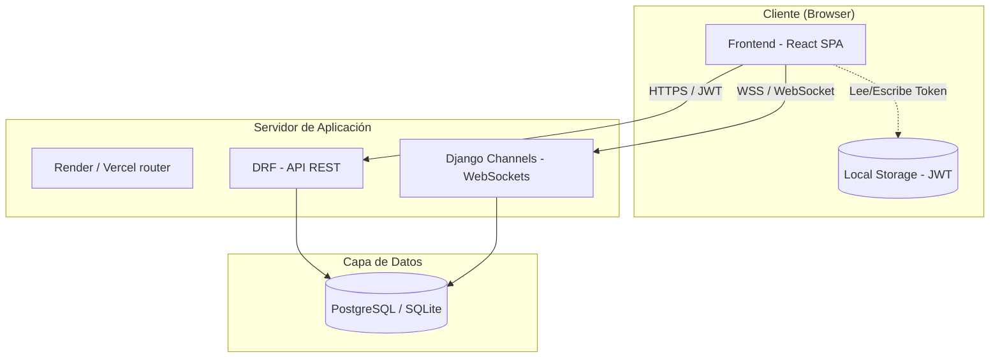
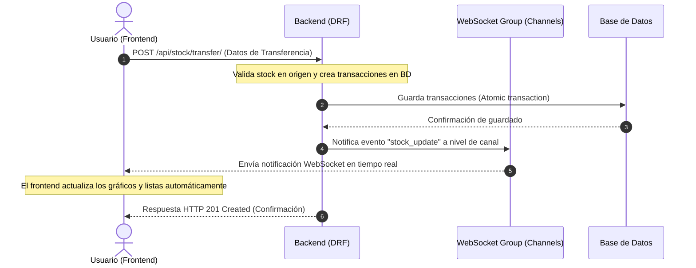
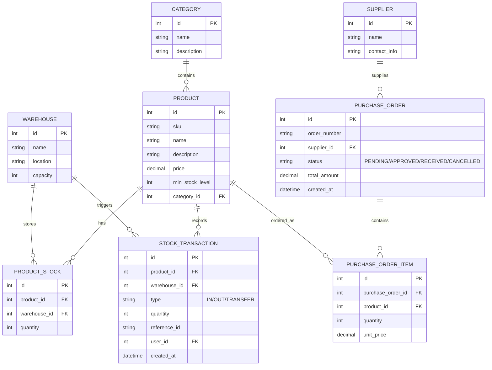
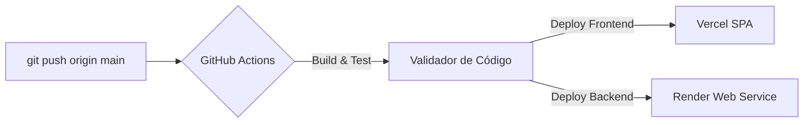

# Arquitectura y Diseño del Sistema (G-Inventory)

Este documento describe la arquitectura técnica, los flujos de datos en tiempo real, el esquema de base de datos y la seguridad por roles de **G-Inventory**.

---

## 1. Arquitectura de Alto Nivel

El sistema sigue una arquitectura desacoplada basada en el patrón de **Single Page Application (SPA)** en el frontend y **API REST / WebSockets** en el backend.

### Componentes Clave:
*   **Frontend (SPA)**: Construido con React 18, Vite y TypeScript. Se encarga de pintar los gráficos de rendimiento y paneles reactivos.
*   **Backend (API & WebSockets)**: Django 5.x utilizando Django REST Framework (DRF) para exponer endpoints de base de datos y Django Channels + Daphne (ASGI) para gestionar el canal persistente de WebSockets.
*   **Bases de Datos**:
    *   *Desarrollo*: SQLite (`backend/db.sqlite3`).
    *   *Producción*: PostgreSQL administrada.

---

## 2. Flujo de Comunicación e Integración de Tiempo Real

El sistema utiliza un modelo de comunicación híbrido:
1.  **Peticiones HTTP (REST)**: Operaciones transaccionales CRUD básicas, autenticación JWT, registro de órdenes de compra, etc.
2.  **WebSockets (Canal Bidireccional)**: Conexión abierta permanente que difunde cambios de stock al instante a todos los clientes conectados cuando ocurre una transacción (entradas, salidas, transferencias y recepciones).

---

## 3. Roles de Usuario y Permisos (Seguridad)

El backend valida cada petición usando tokens JWT. Los roles de seguridad están estructurados de la siguiente manera:

| Rol | Permisos y Capacidades |
| :--- | :--- |
| **Administrador (Superuser)** | • Acceso total a todas las APIs. • Creación y edición de almacenes y categorías. • Consulta de todas las métricas globales. |
| **Manager (Gerente de Almacén)** | • Aprobación de Órdenes de Compra (PO). • Autorización de transferencias entre almacenes. • Creación/Edición de productos y proveedores. |
| **Staff / Auditor** | • Creación de borradores de Órdenes de Compra. • Registro de entradas/salidas manuales (ajustes). • Visualización de existencias y logs históricos. |

---

## 4. Diseño del Esquema de Datos (Base de Datos)

El esquema relacional garantiza la integridad de los datos a través de llaves foráneas y restricciones atómicas:

---

## 5. Pipeline de CI/CD (Infraestructura de Despliegue)

El flujo de entrega continua está automatizado usando **GitHub Actions**:

*   **Frontend (SPA)**: Servido estáticamente por **Vercel** con reglas de reescritura de rutas configuradas en `vercel.json`.
*   **Backend (API)**: Alojado en **Render** ejecutando la aplicación con un servidor ASGI para el soporte concurrente de HTTP y WebSockets.
